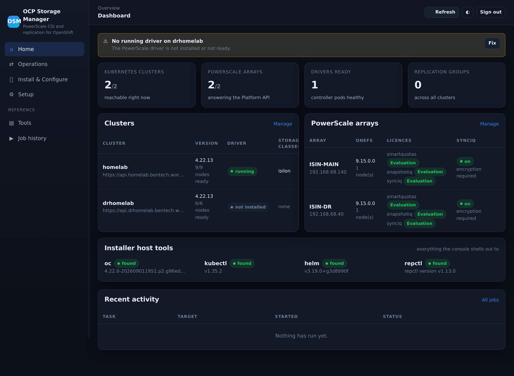
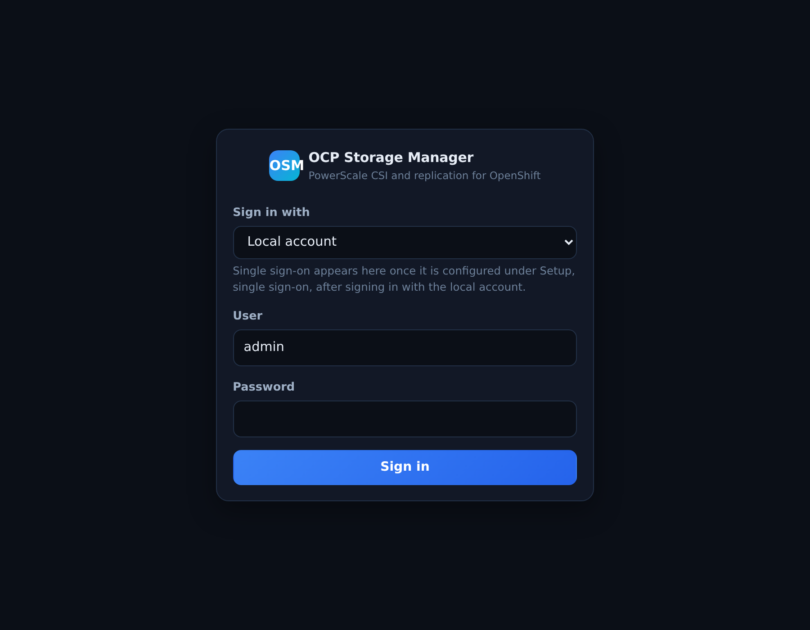
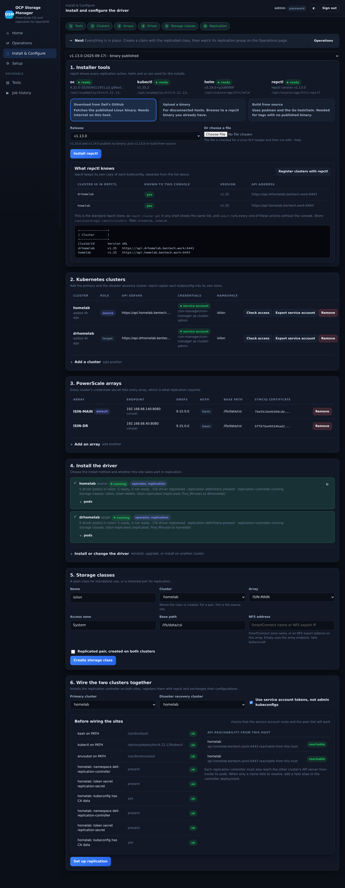
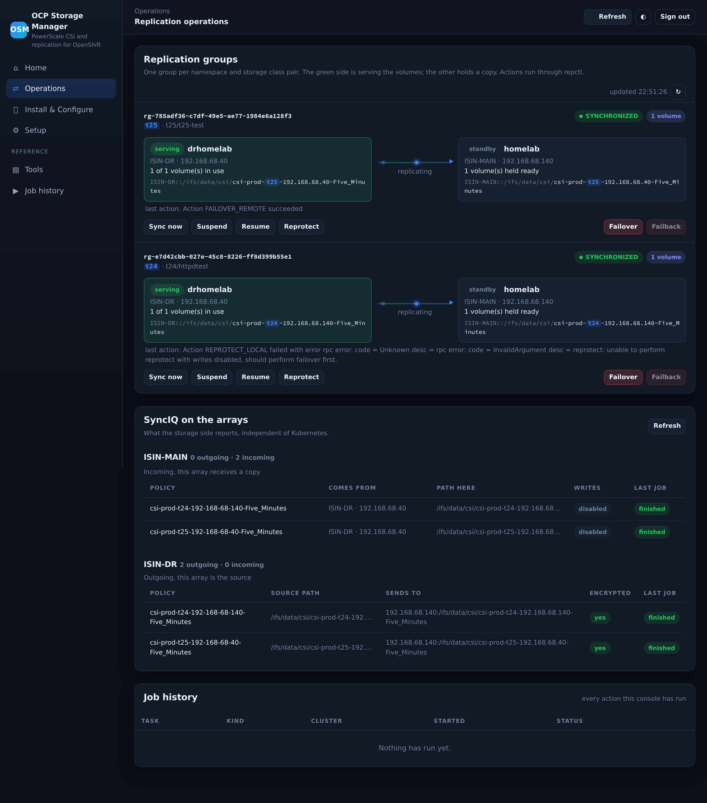
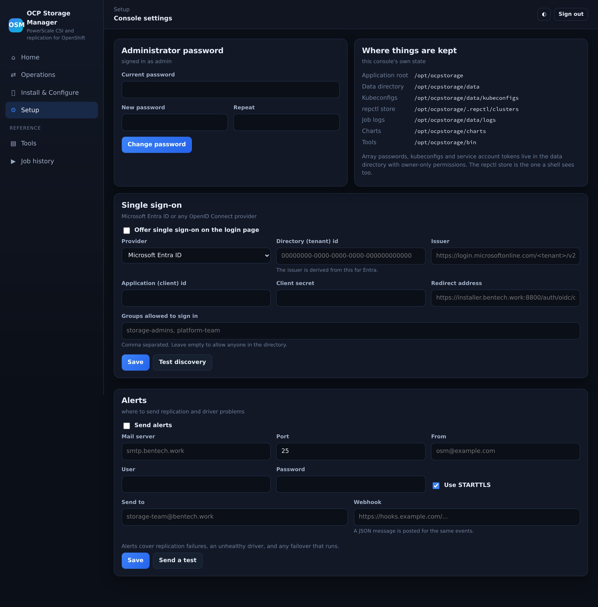

# OCP Storage Manager (OSM)

A web console and command line tool for installing and operating the **Dell CSI PowerScale**
driver and **Dell CSM Replication** on OpenShift, including two-site failover.

Built with FastAPI and server-rendered pages. No build step, no content delivery network and no
database, so it runs happily on a disconnected installer host.





## What it does

* Installs the PowerScale driver either with the **Dell CSM Operator** or with the **Helm chart**,
  standalone or with replication enabled.
* Connects to clusters three ways: sign in with a user such as kubeadmin, upload a kubeconfig, or
  point at one on the installer host. It can then create a service account with a non-expiring
  token and use that from then on.
* Registers PowerScale arrays, reading their version, access zones, licences, privileges and
  SyncIQ certificate, and creating the base path when it is missing.
* Builds the credentials secret, the plain storage class and mirrored replicated pairs, with the
  parameters and recovery point objectives the driver actually accepts.
* Wires two clusters together: replication controllers, `repctl` registration, configuration
  exchange and the peer config map.
* Runs failover, failback, reprotect, suspend, resume and sync against replication groups, and
  shows SyncIQ policies straight from the arrays.
* Streams the output of every action into the page, and keeps the logs.

Everything is also available from `osmctl`, so the console being down never blocks an install or
a failover.

## Pages

| Page | Purpose |
|---|---|
| Home | Cluster, array and driver health, replication group count, tool versions, recent activity |
| Operations | Replication groups and their actions, SyncIQ policies, job history with full logs |
| Install & Configure | Tools, clusters, arrays, driver install, storage classes, replication wiring |
| Setup | Administrator password, Microsoft Entra ID or other OpenID Connect sign-in, alerting, reset |







## Requirements

* Linux host with Python 3.12, reachable from the OpenShift API endpoints and the array management
  addresses.
* `oc` or `kubectl` on the path. `helm` and `repctl` can be vendored in `bin/`, and the console can
  download or build `repctl` for you.
* Dell CSI PowerScale 2.17.1 with CSM Replication 1.15.0. Both charts are vendored in `charts/`.

## Install

```bash
git clone https://github.com/bentech4u/OCP-Storage-Manager-OSM.git /opt/ocpstorage
cd /opt/ocpstorage/app
python3.12 -m venv .venv && .venv/bin/pip install -r requirements.txt

useradd --system --home-dir /opt/ocpstorage --shell /bin/bash ocpstorage
chown -R ocpstorage:ocpstorage /opt/ocpstorage
cp deploy/ocpstorage-console.service /etc/systemd/system/
systemctl enable --now ocpstorage-console
ln -s /opt/ocpstorage/app/osmctl /usr/local/bin/osmctl
```

Open the console and choose an administrator password on first visit.

By default it listens on 8800 over plain http, which is fine on an installer host. To serve https
on 443 as an unprivileged service, make a certificate and give the unit the one capability that
allows binding a low port:

```bash
osmctl admin tls --host <the name or address people browse to>
```

```ini
[Service]
AmbientCapabilities=CAP_NET_BIND_SERVICE
CapabilityBoundingSet=CAP_NET_BIND_SERVICE
Environment=OSM_PORT=443
Environment=OSM_TLS_CERT=/opt/ocpstorage/data/tls/console.crt
Environment=OSM_TLS_KEY=/opt/ocpstorage/data/tls/console.key
```

A self-signed certificate makes browsers warn; replace it with one from your own authority when
this is more than a lab.

## osmctl

```bash
osmctl status                       # tools, clusters, arrays, repctl store
osmctl doctor                       # health check of the whole installation
osmctl cluster add --id cluster-1 --server api.ocp.example.com --user kubeadmin
osmctl cluster serviceaccount --id cluster-1
osmctl array add --endpoint 10.0.0.10 --user csiuser --create-path --auth-type 1
osmctl driver install --cluster cluster-1 --mode replication --method operator
osmctl sc create --name isilon-replicated --cluster cluster-1 --array main \
    --replicated --target-cluster cluster-2 --target-array dr --rpo Five_Minutes
osmctl repctl setup --source cluster-1 --target cluster-2
osmctl rg list
osmctl rg failover --rg <group> --target cluster-2 --yes
osmctl admin passwd                 # locked out of the console? set it here
osmctl admin backup --out /backup/osm.tar.gz
osmctl service restart | logs --follow
```

## Layout

```
app/        the console and osmctl, with its own virtual environment
bin/        helm and repctl
charts/     csi-isilon and csm-replication, vendored for offline installs
values/     base driver values
deploy/     systemd unit
docs/       screenshots
data/       state, kubeconfigs, job logs          (git-ignored)
secrets/    array credentials and certificates    (git-ignored)
.repctl/    repctl's own cluster store            (git-ignored)
```

## Notes from the field

These were checked against Dell's documentation and the driver source rather than assumed, and
they shape how the console behaves:

* The kubeconfig handed to `repctl` needs cluster-admin, because it installs custom resource
  definitions and cluster roles. The identity the replication controller uses at run time needs
  far less, only the `dell-replication-manager-role`, which is why the console offers service
  account tokens instead of injecting admin kubeconfigs.
* `repctl cluster inject --use-sa` only works after the replication controller exists, since it
  reads a token from a service account the chart creates.
* The credentials secret on **every** cluster must list **every** array, with exactly one default
  per cluster.
* `replicationCertificateID` is the SyncIQ target certificate, taken from the remote array's entry.
  On OneFS the identifier is the certificate's SHA-256 fingerprint.
* PowerScale does not implement `swap` or `establish`, so those actions are not offered.
* OneFS 9.15 ships with basic Platform API authentication disabled, which looks like a bare 401.
  It can be re-enabled with `isi_gconfig -t web-config auth_basic=true` followed by an apache2
  restart, and the console reports which authentication types each array accepts.
* A replicated storage class needs six parameters, not the three Dell's page calls mandatory, and
  the recovery point objective must be one of seven exact strings.

## Licence

Apache 2.0. The vendored Dell charts keep their own licences.
